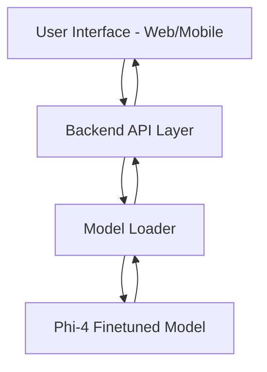

# BFSI Chat Finetuned Model (Phi-4)

A specialized conversational AI model for the Banking, Financial Services, and Insurance (BFSI) sector, fine-tuned on the Phi-4 architecture. This repository contains all resources needed to deploy, test, and further fine-tune the model for industry-specific applications such as customer support, query resolution, and domain knowledge retrieval.

---

## Introduction

The BFSI Chat Finetuned Model (Phi-4) is designed to deliver intelligent, context-aware conversations tailored for the unique needs of financial institutions. Leveraging advanced transfer learning and domain-specific datasets, this repository provides a robust foundation for building chatbots, virtual assistants, and automated agents capable of handling complex BFSI queries. The model can be integrated into web applications, contact centers, or internal tools to improve client engagement and operational efficiency.

---

## Requirements

Before installing or running the model, ensure your environment meets the following requirements:

- **Python 3.8 or higher**: The main scripts and dependencies require at least Python 3.8.
- **PyTorch 1.12+**: The model leverages PyTorch for neural network operations and GPU acceleration.
- **Transformers (Hugging Face)**: Essential for model loading, inference, and tokenizer handling.
- **CUDA** (optional): For GPU-accelerated inference, CUDA toolkit 11.0+ is recommended.
- **Additional Packages**:
  - `sentencepiece`
  - `scikit-learn`
  - `pandas`
  - `numpy`
  - `tqdm`
- **Hardware Recommendations**:
  - At least 8GB RAM (16GB+ preferred for large batch inference or fine-tuning)
  - GPU (NVIDIA Tesla/RTX or higher for best performance)
- **Operating System**:
  - Linux (Ubuntu 20.04+ recommended)
  - macOS (tested on Monterey+)
  - Windows 10/11 (WSL2 recommended for Linux compatibility)

---

## Installation

Follow these steps to set up the repository and prepare the model for use:

### 1. Clone the Repository

```bash
git clone https://github.com/Joshua-Peter7/BFSI-chat-finetuned-model-Phi-4-.git
cd BFSI-chat-finetuned-model-Phi-4-
```

### 2. Set Up a Python Environment

It's advisable to use a virtual environment to manage dependencies.

```bash
python3 -m venv venv
source venv/bin/activate  # On Windows: venv\Scripts\activate
```

### 3. Install Dependencies

Install the required Python packages using pip:

```bash
pip install torch torchvision torchaudio --extra-index-url https://download.pytorch.org/whl/cu118  # For CUDA-enabled GPUs
pip install -r requirements.txt  # If requirements.txt is provided
# OR install manually
pip install transformers sentencepiece scikit-learn pandas numpy tqdm
```

### 4. Download Model Weights

- If model weights are provided in the repository, ensure they are placed in the appropriate directory (e.g., `./model/`).
- If weights are hosted externally (such as Hugging Face Hub or another storage provider), use the provided scripts or instructions to download.

Example using Hugging Face:

```bash
from transformers import AutoModelForCausalLM, AutoTokenizer

tokenizer = AutoTokenizer.from_pretrained("Joshua-Peter7/BFSI-chat-finetuned-model-Phi-4-")
model = AutoModelForCausalLM.from_pretrained("Joshua-Peter7/BFSI-chat-finetuned-model-Phi-4-")
```

### 5. Running the Model

You can interact with the model using a sample script or via a command line interface.

```bash
python chat_inference.py --input "How can I open a savings account?"
```

Or, if using a notebook:

```python
prompt = "What is the process for a home loan application?"
inputs = tokenizer(prompt, return_tensors="pt")
output = model.generate(**inputs, max_new_tokens=128)
response = tokenizer.decode(output[0], skip_special_tokens=True)
print(response)
```

---

## Example Architecture Flow

Below is a simplified architecture of the typical data flow for deploying the BFSI chat model in a production scenario:



---

## Additional Notes

- For fine-tuning the model on custom BFSI datasets, refer to the `finetune.py` script and ensure your dataset is properly formatted.
- For API deployment, consider using FastAPI or Flask with asynchronous inference for scalability.
- Always keep your dependencies updated and ensure GPU drivers (if used) are compatible with your PyTorch installation.

---

## Support

For questions, issues, or feature requests, please open an issue in the repository or contact the maintainer directly via GitHub.

---

## License

Refer to the `LICENSE` file in the repository for detailed licensing information. Ensure compliance before using in commercial products.

---
